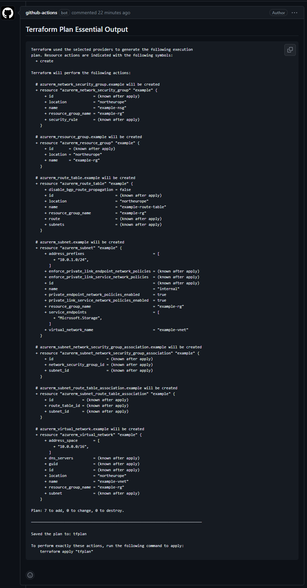

# tf-plan-pr-comment

## Overview
`tf-plan-pr-comment` is a GitHub Action designed to simplify code reviews and enhance compliance. It automatically extracts, annotates, and comments essential Terraform plan output within GitHub Pull Requests.

## Features
- **Automated Extraction**: Isolates crucial parts of the Terraform plan output.
- **Annotation**: Enhances readability by annotating the extracted output.
- **Pull Request Comments**: Posts the annotated output directly on the GitHub Pull Request.
- **Conditional Comments**: Supports comments based on the Terraform plan's exit code.

## Prerequisites
- GitHub Actions enabled on your repository.
- A Terraform project to run this action on.
- An open GitHub Pull Request in the target repository.

## Inputs

| Name          | Description                                         | Default | Required |
|---------------|-----------------------------------------------------|---------|----------|
| `output_file` | Path to the file with the Terraform plan output.    | None    | Yes      |

## Usage


```yaml
- name: Comment Terraform Plan on PR
  uses: blinqas/tf-plan-pr-comment@v1
  with:
    output_file: 'path/to/your/output/file'
  env:
    GITHUB_TOKEN: ${{ secrets.GITHUB_TOKEN }}
```

## Example Workflow
### Key Points:
- Use `-no-color` with terraform plan for parseable output.
- Utilize `2>&1` to redirect both `stdout` and `stderr` to the same file.
- Use `tee` to write the output to a file for the action.
- Assumes terraform plan runs from the repo root.

```yaml
name: Terraform CI

on:
  pull_request:
    paths:
      - '**.tf'

jobs:
  terraform:
    runs-on: ubuntu-latest

    steps:
    - name: Checkout code
      uses: actions/checkout@v2

    - name: Terraform Plan
      run: terraform plan -no-color 2>&1 | tee ${{ github.workspace }}/plan_output.txt

    - name: Comment Terraform Plan on PR
      uses: blinqas/tf-plan-pr-comment@v1
      with:
        output_file: ${{ github.workspace }}/plan_output.txt
      env:
        GITHUB_TOKEN: ${{ secrets.GITHUB_TOKEN }}
```
## Example Comment on the Pull Request


## Contributing
See CONTRIBUTING.md for contribution guidelines.

## License
Licensed under MIT. See LICENSE.md for details.